# comic-maker

## Quick start

### Requirements

- Java 13+ (13, 14, 15)

JavaFX is bundle in the JAR, so it does not need to be linked.

```bash
java -jar apes.jar
```

## Sprints

### Sprint 1 - Launching the application as a GUI

For this sprint, we designed the wireframe of the application using the JavaFX library. We also integrated maven into
our project so that we can install and run the JavaFX application easily. We decided to split the task into 4 different
stories
(Stage, ScrollPane, ColorPicker and Options Pane) and everyone is responsible for one component. After that, we combined
everything together using a Layout class when everyone is finished with their part. Our final product also included two
sample characters to show that our GUI will in fact work nicely with the character images.

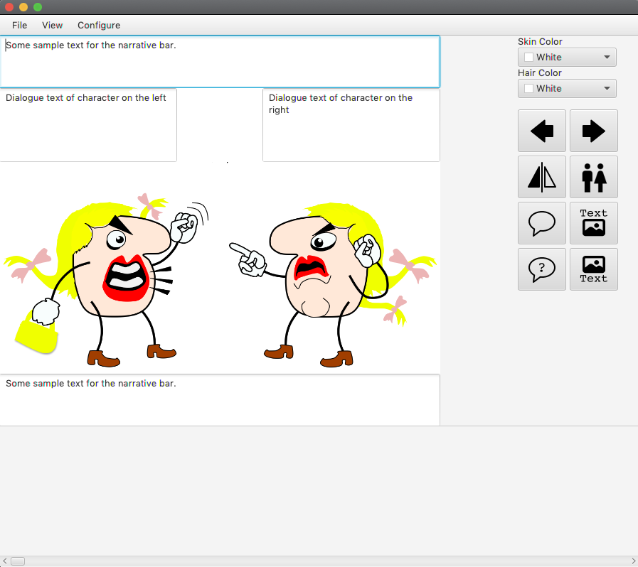

### Sprint 2 - Loading characters and adding support for character flipping

For this sprint, we added a dropdown list for choosing characters, users can choose their desired character, and it will
replace the current characters on the stage. Note that, when switching characters, only the orientation will be
preserved and skin color and other attributes will be reset. To select a blank screen, users can just select the **
blank** selection. To flip either the left or right character, users **must click on the character first** to request
focus, and the selected character will be highlighted in blue. After that, the user can choose to flip the selected
character's orientation either to left-to-right or right-to-left.

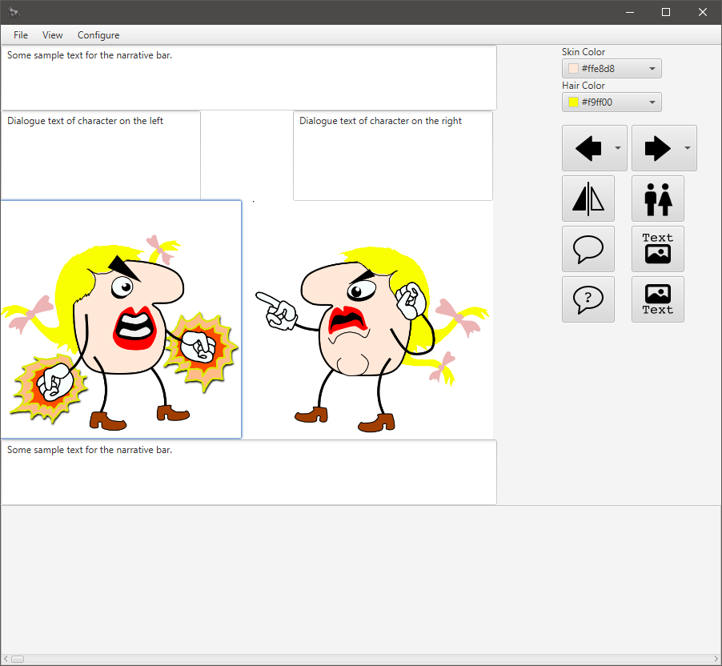

We are using a MVC like architecture to structure our application, and it helps us to separate the core logic from the
view layer. Some extra bonuses we added include a focusing effect when a character is clicked, and also dropdown icons
so that the user can preview the character image before selecting it.

In addition to this week's requirement, we have also completed the stories from sprint 3 so **gender, hair color and
skin color changing are all supported**. More documentation details will be included in the next sprint, but the
features are working in our current release.

### Sprint 3 - Changing Gender, Skin Color and Hair Color

For sprint 3, we completed the gender changing requirement by removing the wig, ribbon and lipstick from default female
characters. Our initial colour changing algorithm is not perfect, since some artifacts still remain after we changed
from one colour to another due to **anti-aliasing**. After multiple changes to our algorithm, it currently works almost
perfectly by using BFS and a threshold. Essentially, our algorithm works by doing BFS on the target colour, and it tries
to propagate and find all similar coloured pixels, effectively removing the anti-aliased edges. To prevent duplicate
work, we used a boolean array to check if a pixel has been visited before. A threshold is a nice optimisation since it
prevents the accidental removal of black coloured edges.

Next, our skin colour changing algorithm works very similarly but for male characters, the lips also need to be coloured
to match the skin colour. After some experimenting, we decided to go with a _re-rendering_ approach, where a fresh copy
of the image is modified for each render (changes to gender, hair colour, so on).

Some extra bonuses we added include a custom colour in the color selector which is the default color of the hair/skin to
let the user reset the skin/hair colour. Besides, when a user clicks on a character, the colour changer changes its
current colour to match the character's skin and hair colour.

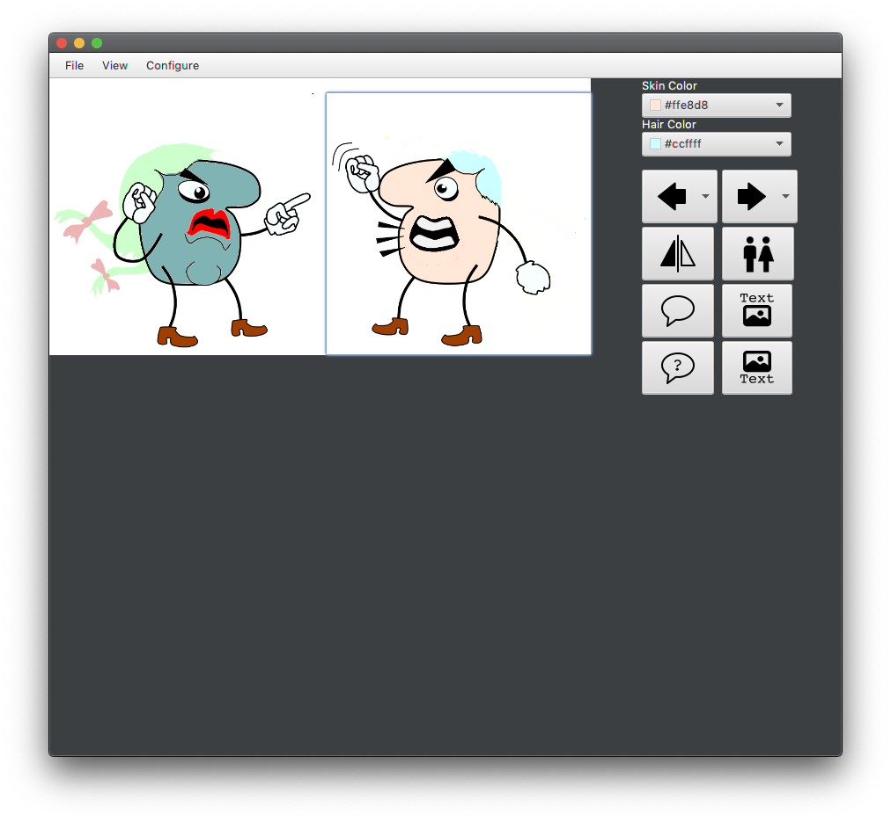

> Note that, to achieve the mentioned features, we created additional entities so that it would be easier to serialize
> the characters in later sprints.

In addition to this week's requirement, we have also completed the stories from sprint 4 so **speech & thought bubble ,
narrative bars are all supported**. More documentation details will be included in the next sprint, but the features are
working in our current release.

### Sprint 4 - Adding Dialogue Boxes

We completed the dialogue boxes for the respective characters by our version work slightly different. After consulting
Prof. Tony about our decision, he agreed via email this approach is indeed fine. We feel that the user should be able to
remove the thought/speech bubbles as they wish (ie reset to initial state without speech bubbles at all). So, we
proposed an alternative approach:
When the speech bubble setting is clicked, instead of prompting the user first, we add an empty speech bubble to the
character, and the user can click on that empty speech bubble to enter their desired text in a popup window. So, our
speech bubble setting will act as a hide/show button for the speech bubbles.

Some extra bonuses we added include a warning which limits the number of characters to 100 to ensure that our
application works and displays correctly. Besides, when say a speech bubble already enabled for a character, clicking on
the thought bubble button directly switches the speech bubble style.

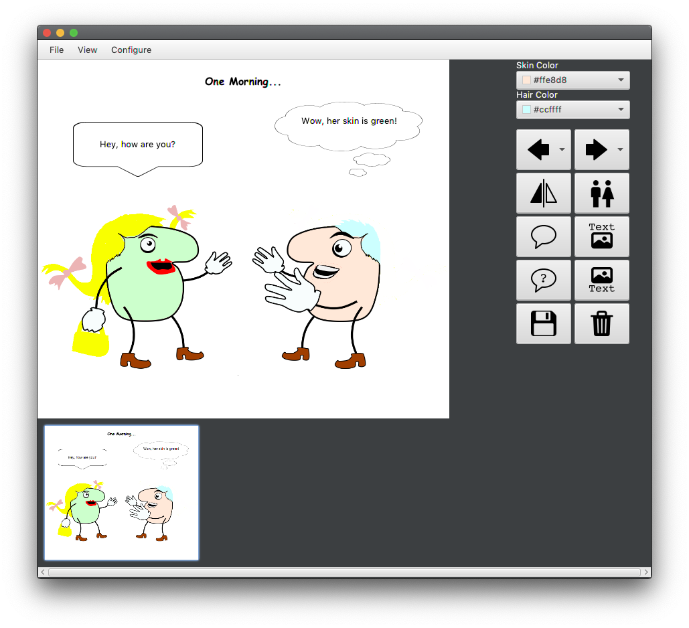

In addition to this week's requirement, we have also completed the stories from sprint 6 so **saving, navigating /
deletion of panels are all supported**. More documentation details will be included in the next sprint, but the features
are working in our current release.

### Sprint 5 - Adding Narrative Bars

For this sprint we added top and bottom narrative bars, which works similarly to the dialogue boxes but in this case,
the user does not need to click on a specific character before clicking the top/bottom narrative button. We also broke
down and refactored some larger classes into smaller classes so that they're easier to work with.

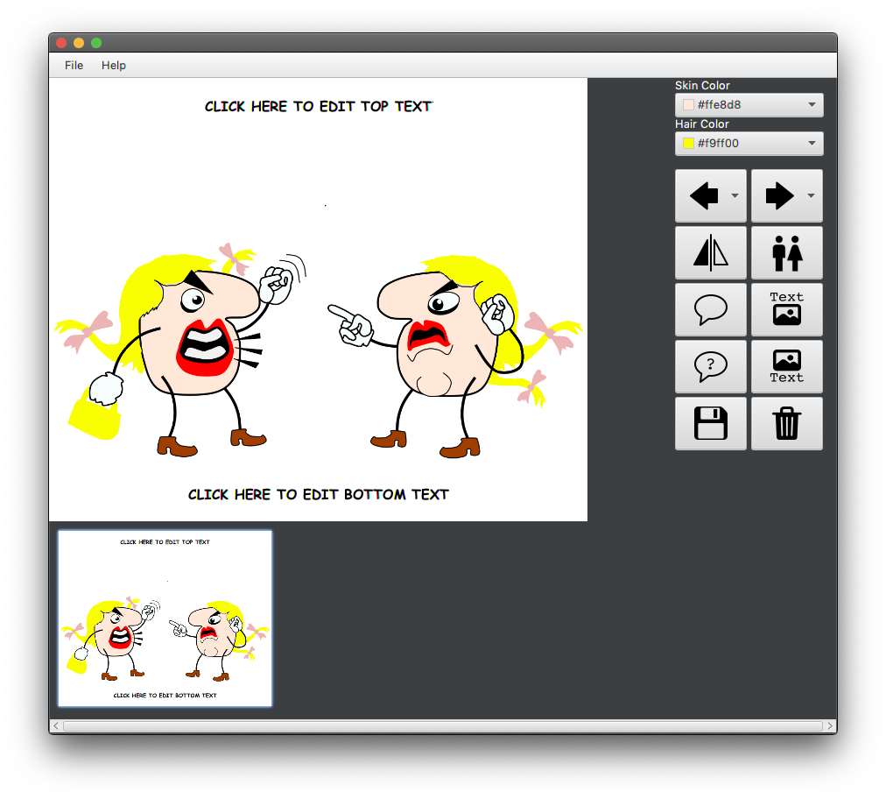

Some extra features/bonuses we included:

- A warning text box is also displayed when the number of characters exceed 100 characters.
- We added a Help popup which first displays when the application is launched. It is also accessible from the top menu
  bar.
- We added a search bar for the character selection list view so that the user can easily search for the character poses
  they need.
- Export as GIF is now supported and can be accessed through, `File -> Export As GIF`. The delay between different
  frames is set to 1s.

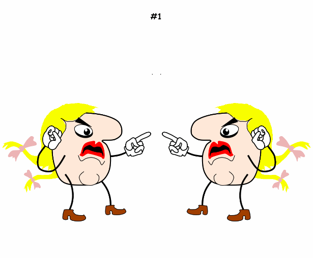

### Sprint 6 - Saving, Loading and Deleting Panels

Github Repo: [https://github.com/AmplifiedHuman/comic-maker](https://github.com/AmplifiedHuman/comic-maker)

In this sprint we added saving, loading and deleting. To save the current pane, just click on the save button, and the
current pane will be saved. To load a pane, click on the thumbnail in the scroll pane, and it will load it into the
working pane. To work on a new pane, save the current pane first, and a new pane will be generated automatically. We
feel that a new button is not necessary for this since the save button is sufficient for this purpose. And finally, to
delete a panel just click on it and click on the delete icon. Alternatively, if you'd like to clear a new panel the
delete button also serves the same purpose.

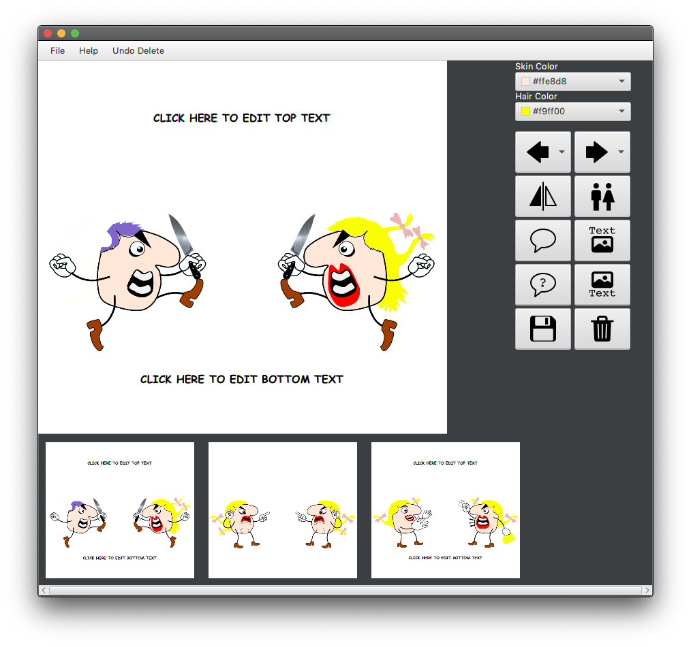

In addition to this week's requirement, we also added/improved some features to improve the overall user experience:

- We changed the stage so that unused space is filled by white space, and it will gradually grow from both sides as the
  dialogue/narrative bar grows larger. The reason for this is due to the fact that GIF generation only works for images
  of the same size.
- Included a prompt to ask the user if they want to save or discard their current panel if the current panel is new or
  modified. Note that, our application can figure out whether if a panel is modified from their original state or is
  empty, so it will not display anything if nothing is modified at all!
- Added delete prompt to make sure it's an intended action.
- Included an **Undo Delete** button so the user can undo any accidental deletes.
- We also made sure that the left, right character selection button and also the color picker is updated correctly after
  loading a saved panel.

### Sprint 7 - importing and exporting xml

This week, we implemented XML importing and exporting in our application. To export to XML do File -> Export As XML and
to import use File -> Import XML. We used a SAX parser (JAXB) rather than a DOM model for easier / modular entity
serialisation. We wrote custom adapters for most properties and also created a few wrapper classes to aid serialisation.

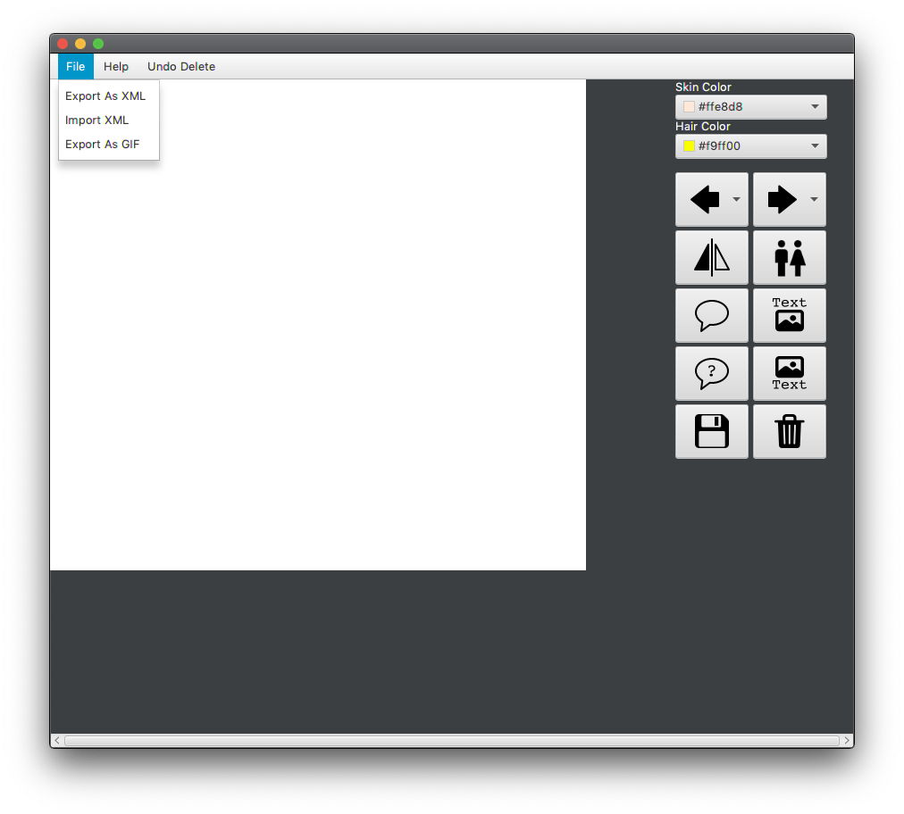

Aside from the core requirements, we added a popup box which shows a scrollable list of errors in the provided XML file
(if there's any) for easier debugging and troubleshooting.

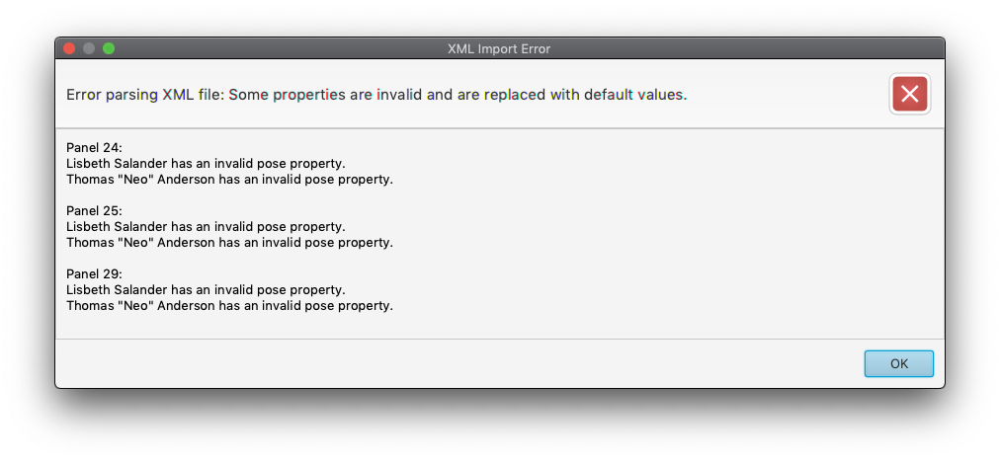

Another improvement we made is the help menu, we manage to integrate helpful images and messages to guide the user so
that it feels more intuitive to use.

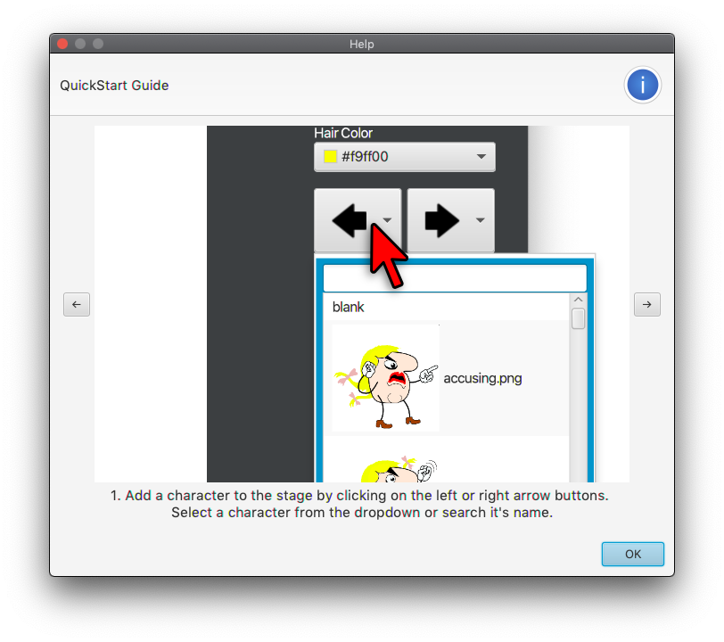

In addition to this week's requirement, we also added/improved some features to improve the overall user experience:

- improved dialogue boxes so that our font automatically resizes depending on the length of the text
- changed the font for narrative bars
- fixed a bug in GIF generation due to improper loading of the ending image

### Sprint 8 - Exporting to HTML

This week, we implemented HTML exporting in our application. To export to XML do File -> Export As HTML. We used a
separate css file for styling, and we generate the html file by using a FileWriter. We also added a prompt to get the
comic title, if a comic premise already exist, it will prefill it with that.

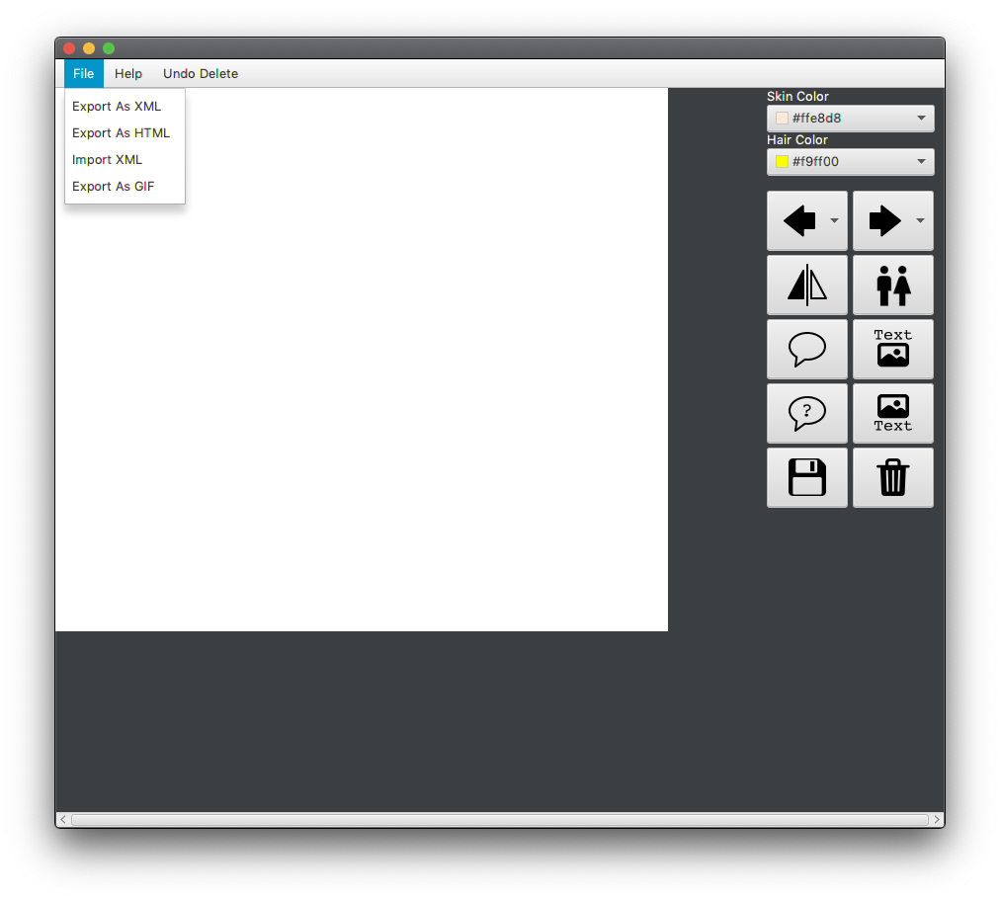

For the generated html webpage, we ensured that it's valid and also responsive which means that it can be viewed comfortably
on both mobile and larger screens.

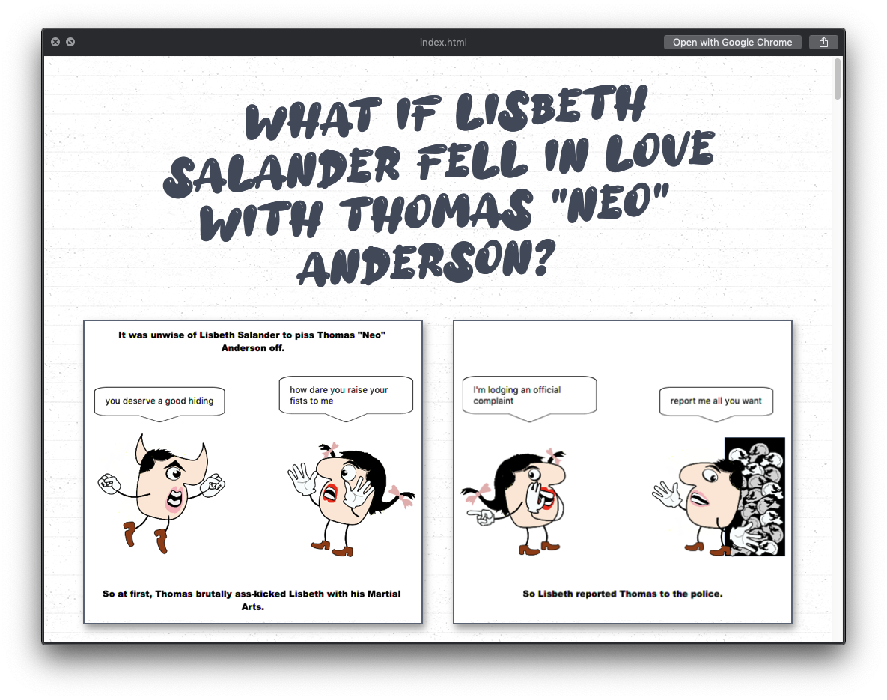

In addition to this week's requirement, we also added/improved some features to improve the overall user experience:

- improved narrative boxes so that our font automatically resizes depending on the length of the text
- we put extra effort in styling the generated html page
- we added an extra end screen if there is an odd number of panes in the generated html page

## Team Members

- Chee Guan Tee (Jason) - [@AmplifiedHuman](https://github.com/AmplifiedHuman)
- Choon Wei Tong - [@choonjerald](https://github.com/choonjerald)
- Simonas Ramonas - [@SimonRamone](https://github.com/simonramone)
- Taranpreet Singh - [@Tyrionpreet](https://github.com/tyrionpreet)