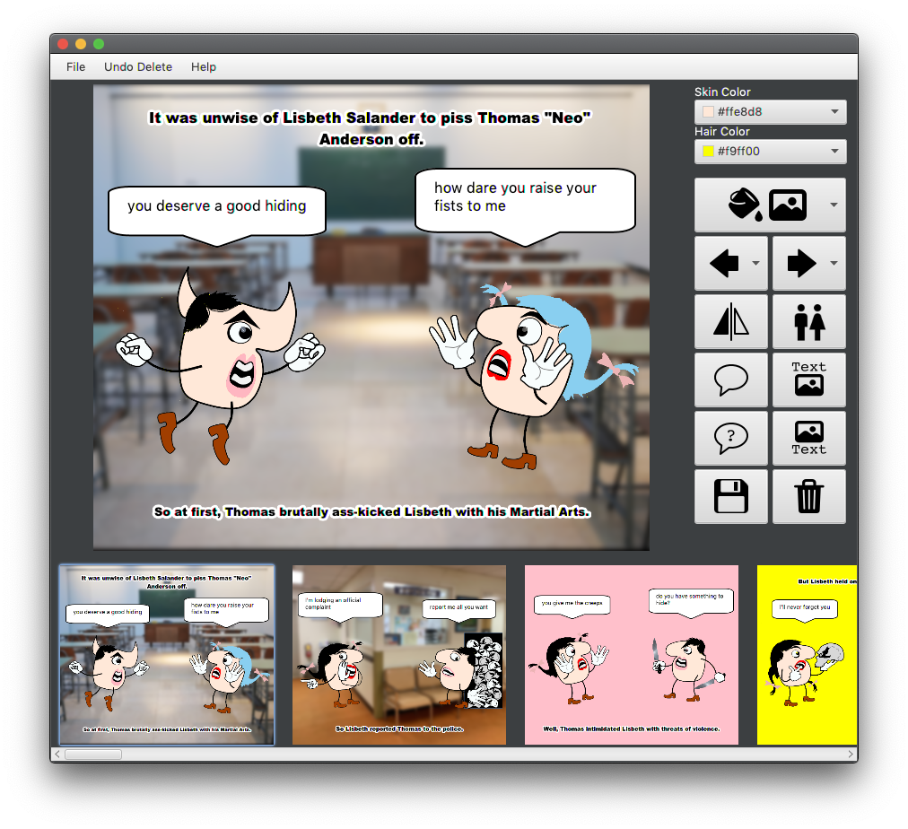
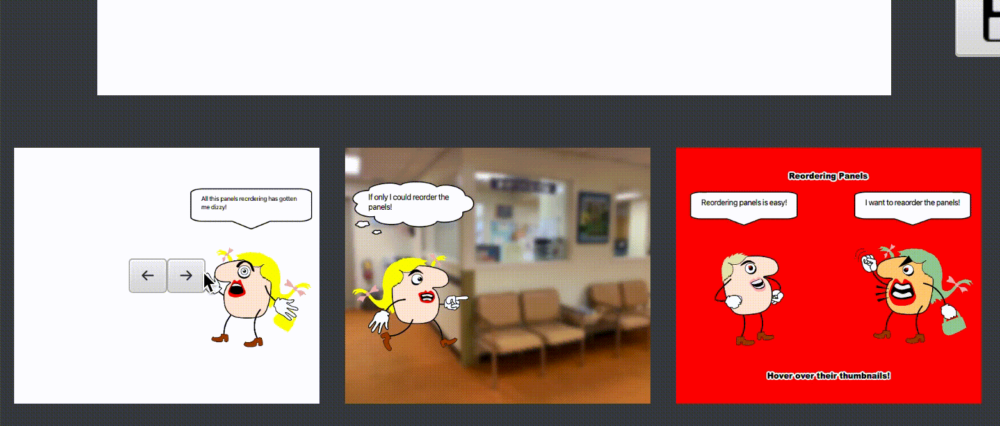

# comic-maker

Detailed progress of previous sprints can be found at [sprints-README.md](./sprints-README.md).



## Quick start

### Requirements

- Java 13+ (13, 14, 15)

JavaFX is bundle in the JAR, so it does not need to be linked.

```bash
java -jar apes.jar
```

## Core Features

We included all the core features mentioned in the specifications (detailed write
up: [sprints-README.md](./sprints-README.md)), so here's a summary of all the features that we have implemented.

- [X] Launching the application as a GUI
- [X] Loading left and right character images into the panel
- [X] Flipping the characters
- [X] Switch the gender of characters
- [X] Change skin color of characters
- [X] Change hair color of characters
- [X] Add dialogue for characters
- [X] Add thought bubble for characters
- [X] Add top and bottom narrative bars for each panel
- [X] Save panels to a row of thumbnails and loading them by clicking on them
- [X] Delete panels
- [X] Reorder panels
- [X] Export and import comic as XML
- [X] Export comic as HTML

For the final sprint, we spent a lot of effort fixing bugs and annoyances so the final application is well polished and
fully functional.

## Extra Features

### Help Popup


On opening the app, the user is greeted with a Help Popup which introduces them to the wide array of features the app
has to offer. The guide uses informative images and minimal text to familiarise the user with the app’s functionalities
in an easy-to-understand manner. The user can access the guide anytime by clicking the Help button in the top menu bar.

### Changing Background


This week, we implemented the ability to add background for the comic panels. To add background, click the background
button that is located at the option pane to reveal a drop down list of available backgrounds. Available backgrounds
include basic colours and some background images. We used our color changer function to make the background of each
character transparent as the provided character images have a white background. Backgrounds are also saved when
exporting to XML and importing also works.

### Better resizing


We have decided to not resize the stage pane as our stage window is big enough in full screen. Resizing the application
now centres the stage pane and options pane to provide a better user experience.

### Themes for Exporting to HTML


The user can export their comic to HTML for viewing in a browser. To export to XML do File -> Export As HTML. We used a
separate css file for styling, and we generate the html file by using a FileWriter. When exporting to HTML, the user is
presented with an array of options (title filled if it exist in XML). The user can choose from three themes, “Action”,
“Notebook”, and “Horror”. Each theme has their own unique background and title font. They can also choose to simplify
the styling by disabling the background texture and removing the decorative title font as well as enabling/disabling the
ending panel.

For the generated html webpage, we ensured that it's valid and also responsive which means that it can be viewed
comfortably on both mobile and larger screens.

### Undo Delete


We included an **Undo Delete** button, so the user can undo any accidental deletes. This only works when there are
deleted panels in the current invocation.

### GIF Generation


We also added a GIF generation functionality that is created by Elliot Kroo. Once the user generates a gif, we add an
end screen that shows that the gif has reached the end of the comic.

### XML Error Popup


Importing XML that has invalid syntax or invalid properties / colours will prompt an error popup to notify the user and
default properties will be used. We made sure that the window is scrollable when there are a lot of errors (if there's
any) for easier debugging and troubleshooting.

### Reordering Panels



The user can effortlessly reorder the panels as they see fit. Hovering over a panel’s thumbnail in the scrolling pane
displays two arrow buttons. Clicking the buttons moves the panel in the corresponding direction. These panels are stored
in a Map and are reordered by swapping positions of adjacent panels.

## Team Members

- Chee Guan Tee (Jason) - [@AmplifiedHuman](https://github.com/AmplifiedHuman)
- Choon Wei Tong - [@choonjerald](https://github.com/choonjerald)
- Simonas Ramonas - [@SimonRamone](https://github.com/simonramone)
- Taranpreet Singh - [@Tyrionpreet](https://github.com/tyrionpreet)